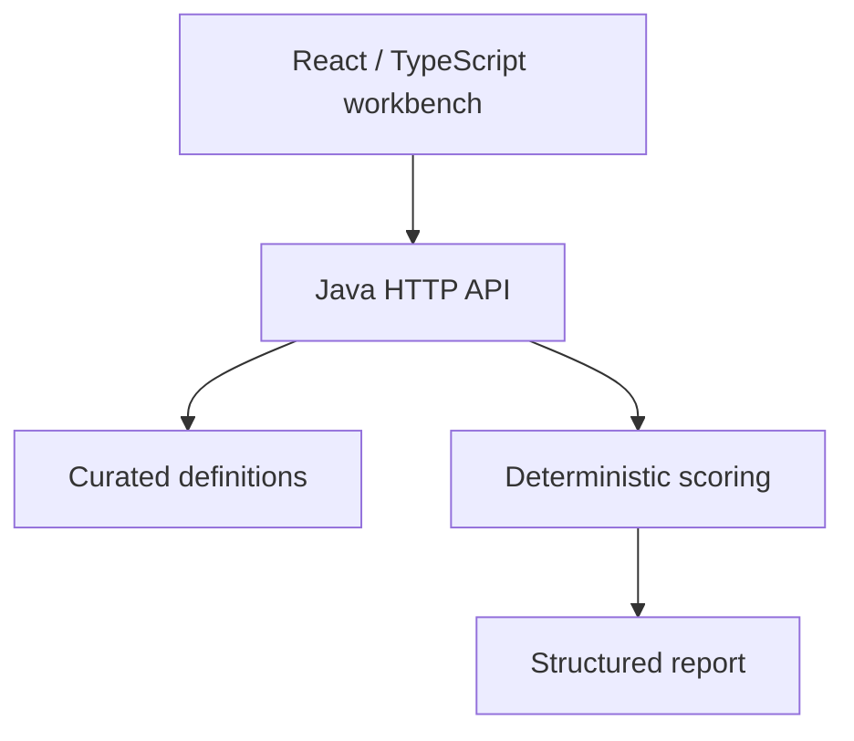
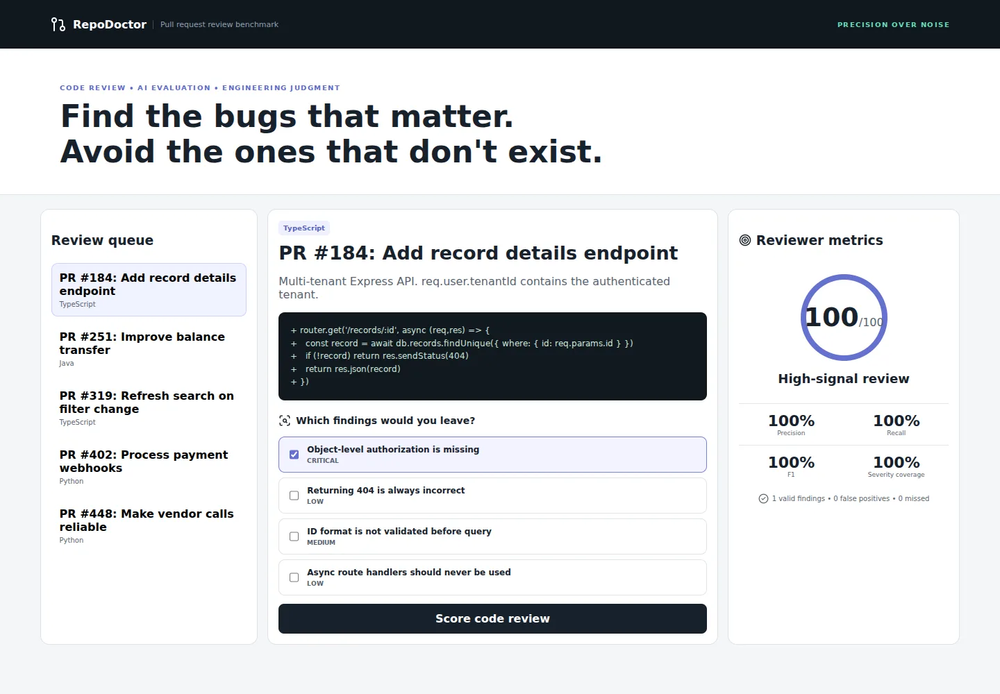

# RepoDoctor

A Java-backed pull-request review benchmark that rewards valid findings and penalizes false positives.

[](https://github.com/yeabsira-mesfin/repo-doctor/actions)

**Live demo:** [https://repo-doctor-beta.vercel.app/](https://repo-doctor-beta.vercel.app/) · **GitHub Pages:** [Open demo](https://yeabsira-mesfin.github.io/repo-doctor/) · **API health:** [Check API](https://repo-doctor-beta.vercel.app/health)

## Why this exists

Useful code review requires distinguishing consequential defects from guesses and style preferences. Precision matters alongside recall, especially when reviewing unfamiliar code.

## Important features

- Five curated review cases covering tenant authorization, transfer concurrency, React effect correctness, webhook integrity, and vendor API reliability.
- Diff fragments and finding selections containing both valid defects and distractors.
- Precision, recall, F1, severity coverage, and an overall weighted score.
- Server-side gold sets omitted from public case responses.
- Bounded form requests and validation of finding IDs.
- Framework-free Java service with an environment-configurable port.

## Architecture

The React client calls a stateless scoring API. Curated task/rule definitions and score policies live in the backend. Production requests use the same-origin API by default; local development defaults to the backend port. No database, credential, or paid AI API is needed.



## Technology stack

Java 17 JDK HTTP server, React, TypeScript, Vite, Java assertions, Docker, GitHub Actions.

## Evaluation methodology

`precision = TP / selected`, `recall = TP / gold`, and `F1 = 2PR / (P + R)`. Empty selections score zero precision/F1. Severity coverage is the recovered gold weight divided by all gold weight: critical 4, high 3, medium 2, low 1.

`overall = round(100 × (0.50 F1 + 0.30 precision + 0.20 severity coverage))`

Selections are deduplicated. Unknown IDs are rejected. Reporting all options lowers precision and score. Gold findings must be supported by the snippet/context: ID-format validation and decimal money representation are not treated as proven defects when the required facts are absent. These are curated practice cases, not measured agent/model results.

## Example

In the tenant record lookup, selecting only `bola` produces precision/recall/F1 of 1 and a score of 100 against the curated gold set. Selecting every option adds three false positives and reduces the overall score. The Java assertion suite verifies full, partial, empty, and noisy selections across all five cases.

## Security considerations

- Submitted content is treated as data. There is no `eval`, shell execution of submissions, arbitrary repository checkout, or candidate code execution.
- Requests are bounded and validated; UI requests time out and surface errors.
- APIs are public, stateless demonstration endpoints. CORS permits configured origins, but CORS is not authentication. Configure `ALLOWED_ORIGINS` as a comma-separated list of exact frontend origins for cross-origin hosting.
- No secrets are required. `VITE_` variables are public bundle contents; use `VITE_API_BASE_URL` only for an API URL.
- Do not submit private code, customer data, or real credentials. The application does not intentionally persist submissions, but hosting providers can retain request/access metadata.
- Hosting-level rate limits and abuse controls are needed before wider public traffic. Future executable evaluation must use disposable, isolated environments with resource limits, restricted networking, and no production credentials. The ordinary application Dockerfiles are not an untrusted-code sandbox.

## Project structure

```text
frontend/src/App.tsx                   Review console
backend/src/dev/repodoc/Cases.java      Curated cases and server gold
backend/src/dev/repodoc/ScoreEngine.java Metric calculations
backend/src/dev/repodoc/Server.java     JDK HTTP API
backend/src/dev/repodoc/Json.java       Curated response serialization
backend/src/dev/repodoc/ScoreEngineTest.java Assertions
.github/workflows/ci.yml   Build and backend tests
vercel.json               Frontend/backend service routing
docker-compose.yml       Local same-origin demo
```

## Local setup

Requirements: Node.js 22, Java 17 JDK. Start backend and frontend in separate terminals.

```bash
cd backend
# Install a Java 17 JDK, including javac
./build.sh
java -cp out dev.repodoc.Server
```

```bash
cd frontend
npm ci
npm run dev
```

Open `http://localhost:5173`. The API listens at `http://localhost:8090`. If overriding the API location, copy `frontend/.env.example` to `frontend/.env.local` and set `VITE_API_BASE_URL`. Restart Vite after changing it.

For the same-origin Docker demo:

```bash
docker compose up --build
```

Open `http://localhost:5173`. Nginx proxies API requests to the backend and serves SPA deep links. Docker configuration is provided; consult the QA notes for whether a container build was actually run.

## Testing

```bash
cd frontend
npm ci
npm run build   # includes strict TypeScript checking
```

```bash
cd backend
./build.sh && ./test.sh
```

[QA notes](docs/QA.md) record actual checks and limitations. CI installs from committed npm lockfiles. Test results are software verification, not benchmark/model evaluation data.

## Deployment

**Vercel:** import this repository with the repository root selected. `vercel.json` defines the React frontend plus the existing backend as separate services. Services are currently Beta. RepoDoctor uses a Java container, DebugArena uses an Express container, and the Python projects use FastAPI services. API routes precede the frontend catch-all. Production defaults to a same-origin API, avoiding cross-origin configuration and localhost leakage. If deploying the frontend alone, select `frontend` as root and set `VITE_API_BASE_URL` to the deployed API origin before building.

**Alternative API hosting:** use the backend Dockerfile on a provider supporting that runtime, such as Render. Set `ALLOWED_ORIGINS` to the exact frontend URL and set the frontend public API origin. RepoDoctor accepts `PORT`; use the Dockerfile's documented port for Python/Node deployments or override the startup command.

**GitHub Pages:** Pages can host only the static React frontend, not Python/Node/Java APIs. Pages is enabled with GitHub Actions. The workflow runs on main-branch pushes or manual dispatch and uses the deployed Vercel API by default. Set repository variable `PUBLIC_API_BASE_URL` to override that public origin. The build derives its base path from the repository name so renamed repositories retain working assets. Without a hosted API it cannot provide the interactive evaluator.

Free-tier terms are time-sensitive. Current official references: [Vercel Hobby](https://vercel.com/docs/plans/hobby), [Vercel Services pricing](https://vercel.com/docs/services/pricing), [Render free services](https://render.com/docs/free), and [GitHub Pages limits](https://docs.github.com/en/pages/getting-started-with-github-pages/github-pages-limits). Hobby has usage caps and personal/noncommercial restrictions. Render free web services have sleep/usage limits. No provider is claimed to be permanently free.

## Screenshots and demo

Actual screenshots from the production build running locally against its backend:



[Mobile screenshot](docs/screenshots/mobile.webp) · [QA notes](docs/QA.md)

These show curated fixture evaluations, not measured model performance. Both public demos use the hosted backend. See [verified deployment checks](docs/deployment-checks.json).

## What this demonstrates professionally

Java engineering, code review judgment, false-positive control, authorization analysis, concurrency reasoning, React correctness, and evaluation metric design.

## Limitations

Only five curated cases exist. Gold sets are visible in this open-source repository and are not suitable for confidential testing. The API has no durable storage or user accounts.

## Author

**Yeabsira Mesfin**
Full Stack Software Engineer · M.S. Cybersecurity in Computer Science student
